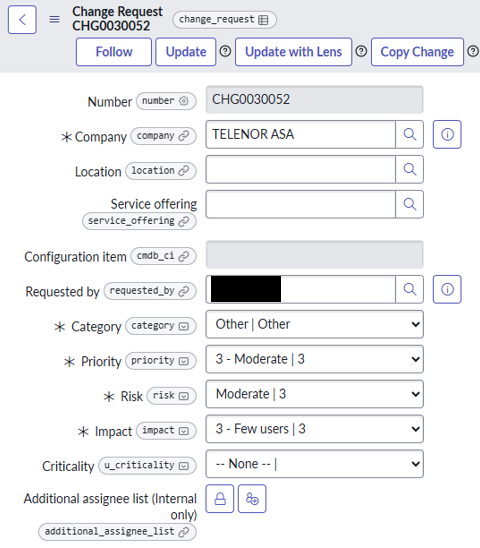
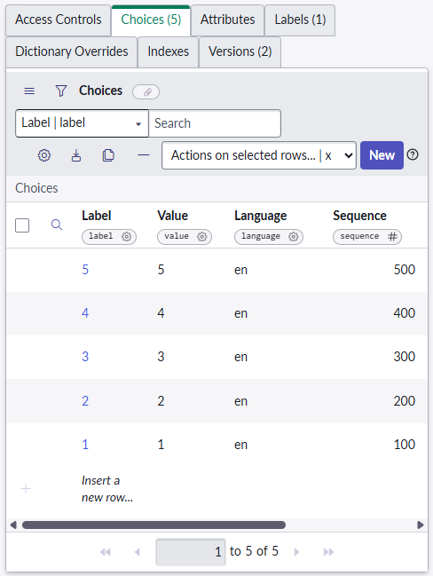
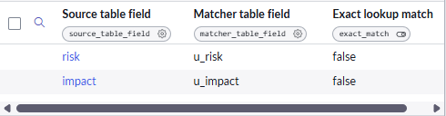
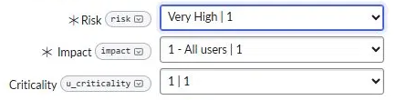
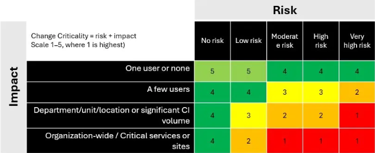
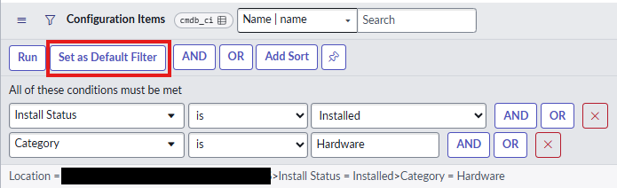
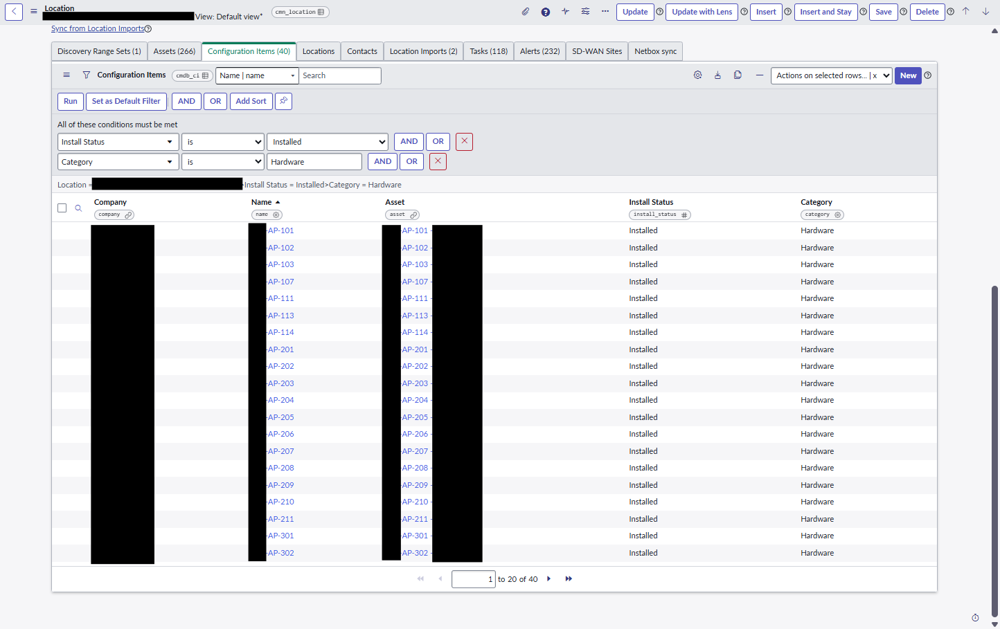
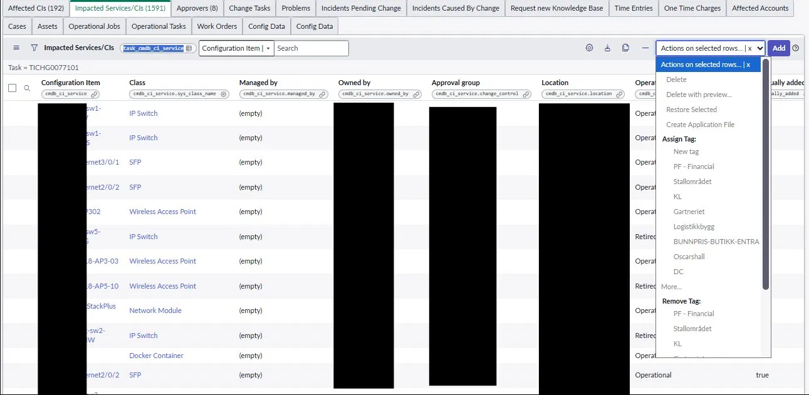
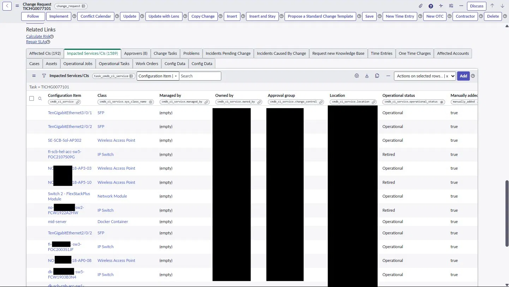
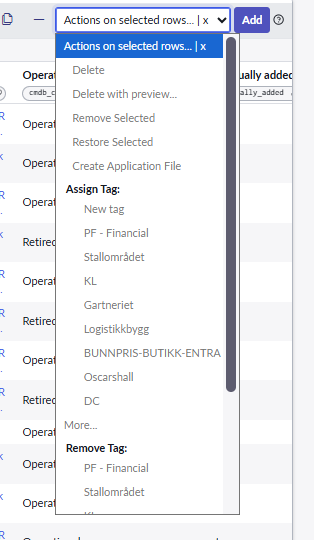

# Gjennomføring – Fagprøve – IT-Utvikling

*Falk von Krogh*  
*15.6.2026 – 23.6.2026*

# Innhold

- [Generell info](#generell-info)
- [STRY0019743](#stry0019743)
  - [Teknisk](#teknisk)
  - [Oppgavedokumentasjon](#oppgavedokumentasjon)
  - [Testrapport – DEV](#testrapport--dev)
  - [Testrapport – TEST](#testrapport--test)
- [STRY0019744](#stry0019744)
  - [Teknisk](#teknisk-1)
  - [Oppgavedokumentasjon](#oppgavedokumentasjon-1)
  - [Testrapport – DEV](#testrapport--dev-1)
  - [Testrapport – TEST](#testrapport--test-1)
- [STRY0019741](#stry0019741)
  - [Teknisk](#teknisk-2)
  - [Oppgavedokumentasjon](#oppgavedokumentasjon-2)
  - [Testrapport – DEV](#testrapport--dev-2)
  - [Testrapport – TEST](#testrapport--test-2)
- [STRY0019745](#stry0019745)
  - [Teknisk](#teknisk-3)
  - [Oppgavedokumentasjon](#oppgavedokumentasjon-3)
  - [Testrapport – DEV](#testrapport--dev-3)
  - [Testrapport – TEST](#testrapport--test-3)
- [Kilder](#kilder)

# Generell info

I Telenor jobber vi i tre forskjellige miljøer. De er delt inn som følgende –

- Dev – Utviklingen skjer her, men andre jobber her og man skal være forsiktig slik at man ikke ødelegger for andre som jobber samtidig.

- Test – Er i all hovedsak likt som prod. Målet her er å finne feil som ikke dukket opp i dev for å rette de opp før de flyttes til produksjon.

- Prod – Er siste instansen. Denne går ut til bruker og kun system administratorer skal ha mulighet for å endre ting her og det skjer kun hvis det ikke kan fikses i de andre instansene.

Når jeg gjør disse oppgavene så kommer de nok ikke til å flyttes til produksjon før etter fagprøven er ferdig fordi brukertesting kan ta flere uker.

Når det gjelder flytting oppover i instanser så kommer jeg til å flytte fulle stories fortløpende. Det som er viktig er å flytte i riktig rekkefølge. For eksempel så må STRY0019743 flyttes før STRY0019744 slik at 744 faktisk har ett felt den kan bruke. Det vil si at jeg flytter funksjonelle grupper samtidig som for eksempel 743 og 744, men de andre storyene vil nok flyttes individuelt opp med mindre de har en sammenheng.

Som nevnt i Planleggingsdokumentet mitt så blir Claude brukt her også. Jeg har ADHD og har som effekt av det problemer med prioriteringer samt samling av tanker på store oppgaver. Jeg bruker derfor Claude som en kollega som jeg konstant kan oppdatere om hvor jeg ligger, hvor den da vil gi meg en anbefaling på hva jeg burde gjøre som neste steg. Den vil ikke gi svar, men det den også kan hjelpe med er å gi meg en liten pekefinger for hvor jeg kan lete eller hvordan formulere ett godt søk.

# STRY0019743

## Teknisk

- Opprettet feltet «u_criticality» på «change_request”, Type «choice”

- Choice-verdiene er 1-5 og value lagres som tall 1-5

- Feltet ble plassert under allerede eksisterende «Impact» felt

- Updateset: STRY0019743 – FVK

 

## Oppgavedokumentasjon

Starter med å åpne en tilfeldig Change ticket. Jeg velger en som spesifikt har navnet «test» for å være sikker på at det ikke skjer noe uforventet, selv om jeg er i dev miljøet. Når jeg åpnet denne formen så fant jeg fort ut at feltet ikke var en som fantes fra før. Denne ble laget på nytt etter spesifikasjonene som jeg har i acceptance criteria, men også etter funn fra planleggingsfasen.

Jeg valgte også choice av en god grunn. Dette var fordi jeg vil følge en standard om allerede eksisterer i systemet og rundt denne typen. Risk og Impact feltene bruker begge Choice, og jeg valgte dermed det samme for å beholde en standard mellom feltene som skal jobbe sammen for å unngå uforutsette feil. Derimot så har choice sine svakheter, for eksempel 2 sifrede verdier. I denne «casen» så skal det kun være 1 sifrede tall, men om det skulle bli 2 sifrede så kan de gi en rar sortering som (1,10,2,3…). En av fordelene er at jeg kan gi de en label i etterkant hvis det er en ønsket endring for seinere, for eksempel («1-Highest») uten å endre hele datamodellen.

Denne var ganske enkel å planlegge i forrige fase så jeg slapp avvik fra planen i denne oppgaven.

Notater: Claude var min sparringspartner bak denne oppgaven. Den ble brukt for å resonnere frem til hvilket type felt «criticality» skulle være (choice eller integer) samt det ene punktet om «read-only» som kommer i testrapporten under senere.

## Testrapport – DEV

Feltet ble testet i en change ticket og ingen feil ble funnet. Feltet er plassert på riktig sted med riktige verdier som forventet uten at noe underliggende data ble endret på. Jeg har ved bevisst valg, valgt å ikke sette feltet til read only for nå selv om det står som acceptance criteria (Read-only ble satt i forbindelse med 744 (se der), og er verifisert i TEST). Dette er fordi jeg ønsker at feltet skal være åpent frem til jeg får gjort STRY0019744, slik at den ikke blir forhindret av ett eventuelt read_only felt i testing. Denne vil selvfølgelig bli satt til read only før storyen flyttes videre opp til test miljøet.

## Testrapport – TEST

Testet av Alexander Ovid og testing gikk perfekt. Feltet vises der det skal, og feltet er satt til Read only.

Jeg startet ved å åpne en tilfeldig change request og dermed scrolle ned for å finne feltet jeg lagde. Det sitter på riktig sted under impact og feltet er Read only som forventet.

# STRY0019744

## Teknisk

- Opprettet tabellen «u_change_criticality_matrix» (extends table «dl_matcher»)
- Oppretter 3 entries i tabellen (avansert visning)
  - Type : choice
  - Column label : risk / impact / criticality
  - Choice Dropdown with –None–
  - Choice table : Change Request \[change_request\] (task \[task\] på impact)
  - Choice field : risk / impact / criticality
- Opprettet Data lookup definition
  - Name : Change Criticality Lookup
  - Source table : change_request
  - Matcher table : Change Criticality Matrix
  - Run on update : true
  - Always replace : true (satt etter testfunn, se Testrapport-TEST)
- Laget nye Matcher Field Definitions (criticality blir laget som Setter Field Definitions)

- 20 matriserader laget

- Read only er satt på criticality feltet

## Oppgavedokumentasjon

Starter hele oppgaven først med å lage en change record som jeg kan bruke som et steg videre til andre innstillinger, samt bruke for testing senere.

Neste steget blir å faktisk begynne å lage matrisen. Dette begynner med å lage en Matcher tabell som bruker allerede eksisterende mal slik at man ikke må bygge helt ny logikk fra bunn.

Etter dette må man lage feltene som skal tas i bruk i denne tabellen (u_risk, u_impact, u_criticality). Disse må lages først slik at definisjonen i neste steg har et sted å referere til.

Data Lookup Definition i ganske enkel å sette opp om har dataen som skal inn der, og dataen jeg brukte ligger i den tekniske dokumentasjonen over.

Både Matcher Field Definitions samt Setter field Definitions ligger inni Data Lookup Definition, og de fungerer som input og output I definisjonen. Matcher = input, Setter = output

Det å fylle Matrise-tabellen er det som tar lengst tid. Den skal følge likt som bildet under, hvor hver rad er en unik kombinasjon av risk + impact som dermed viser hvor kritisk.

## Testrapport – DEV

Test av denne gjøres ved å bruke changen vi lagde på starten, og dermed sette en verdi i risk og impact for å verifisere at Data Lookup Definisjonen fungerer som den skal. Jeg

kjørte to tester som besto av Very High + All Users og fikk Criticality 1 som svar tilbake, pluss en High + Department/Unit/Location og fikk tilbake Criticality 2 der som er riktig og forventet resultat.

Jeg sto fast en liten stund på en feil som kunne vært enkel om jeg hadde lest ferdig hele forklaringen på Data Lookup Definitions før jeg startet å jobbe. Criticality hadde jeg med ett uhell puttet i «Matcher» listen istedenfor «Setter» listen som gjorde at jeg aldri fikk noen form for output. Dette er fordi en matcher krever at verdien på changen er lik verdien i matriseraden, som betyr at changens tomme criticality aldri kunne matche, så ingen rad ble funnet. Endret dette ved å flytte den til «Setter» og da funket den som forventet.

Siste blir å sette feltet i formen til Read-Only. Det finnes flere måter å gjøre dette på, men valgte å gjøre dette med en UI-Policy fordi UI Policy låser feltet på formen der brukeren møter det. Jeg valgte bevisst ikke hard dictionary-lås eller ACL fordi feltet ikke krever beskyttelse på datalag-nivå, Data Lookup eier verdien, og en form-level lås er tilstrekkelig for use casen.

Under planlegging så fant jeg ut at u_impact henter fra Task tabellen, mens de andre henter fra Change_request. Jeg trodde at dette ville bli ett problem, men etter at jeg fikk testet så kunne bekrefte at dette ikke ble ett problem når de var koblet sammen på denne måten.

## Testrapport – TEST

Testingen ble gjort sammen med Alexander Ovid i en samtale. Det var en feil som måtte endres på og det skyldtes en innstilling som ikke var aktivert (Always replace). Problemet er at hvis den ikke er aktivert så vil ikke Criticality feltet oppdateres med mindre den er tom. Dette var ett problem som jeg løste mens jeg var i samtale med Ovid. Alt annet, for eksempel at de 20 kombinasjonene fortsatt gir riktig criticality, fungerte som forventet.

# STRY0019741

## Teknisk

Tabell – cmdb_ci

Filter spesifikasjoner v.1–

- Install Status = Installed

- Category = Hardware

v.2 er den siste og aktive løsningen.

Filter spesifikasjoner v.2-

- Class = IP Router, IP Switch, Wireless Access Point, Cisco Firewall Device, Wlan Controller, Cisco ISE, IP Firewall

- Install Status = Installed

## Oppgavedokumentasjon

Basert på det jeg skrev i planleggingen så ble det gjort ett ganske stort avvik fra planen når jeg først fikk muligheten til å grave i systemet for å finne den beste mulige løsningen.

Jeg lette meg først igjennom ganske lenge for å finne ut hvordan jeg skulle gjøre det selv uten å søke slik at jeg også fikk ett bedre overblikk over hele området slik at jeg kan ta valg som har en tilnærmet null effekt over andre ting som er koblet til skjemaet.

Jeg startet med å finne frem Related listen som jeg skulle sette filteret på og begynte å lete der jeg hadde holdt på tidligere i lærlingperioden min. Dette var da Related list konfigurasjon som dessverre kun var innstillinger for hvilke lister som skulle vises og ikke filteret på disse.

Jeg gjorde ett kjapt søk i Servicenow dokumentasjonen og fant svaret umiddelbart.

Jeg var ikke klar over at det var en knapp som jeg hadde oversett hele tiden som gjør nøyaktig det jeg trengte.

Etter tilbakemelding fra Toheed så bygde jeg et mye mer omfattende filter basert på Toheed sin anbefaling som er skrevet som v.2 i den tekniske dokumentasjonen over. Denne nye versjonen filtrerer på de gjeldende klassene individuelt istedenfor en «generell» kategori. Dette er mye mer sikkert og forhindrer at feil enheter slipper inn videre hvis det skulle komme nye enheter som har samme kategori, men som ikke skal inn i filteret.

## Testrapport – DEV

Etter riktig filter var satt så kan jeg refreshe og filteret ble sittende uavhengig av hvilken bruker jeg «impersonatet» eller lokasjon som ble valgt.

V.1 (Category basert)  
Filtrering på Category = Hardware var en foreløpig tilnærming. Avklarte med Toheed Ahmed (CMDB ansvarlig) om nettverksenheter bør filtreres på CI-klasse (sys_class_name) for å treffe kravet presist (routers/switches/APs/firewalls, ekskl. power supplies/interfaces)

V.2 (Klassebasert)  
Etter avklaring med Toheed ble filteret lagt om til klassebasert (v.2), som verifisert nedenfor.

## Testrapport – TEST

18.06 : TEST-validering av faktisk tester gjenstår (tester utilgjengelig). Egenverifisering i Test: filteret vises som default og er overstyrbart (verifisert via impersonation), identisk med Dev.

19.06 : Tester (Lydia) har gått igjennom og ga følgende tilbakemelding «Impersonated a telecom fulfiller user, the CIs related list on a location record is filtered by the given classes and Installed status. The user is able to remove/edit the filter.  
The filtering works as described in the acceptance criteria»

# STRY0019745

## Teknisk

Tabell (koblingsrad) – task_cmdb_ci_service

Tabell (main – skal ikke slettes fra) – cmdb_ci

UI Action

Name – Remove Selected

Action name – remove_selected

Table – task_cmdb_ci_service

List choice (checked)

Script ligger i github ved navn “remove_selected.js”

## Oppgavedokumentasjon

Startet med å finne koblingsraden slik at jeg fikk startet med å lage UI Action så fort som mulig. Opprettelsen av UI Action gikk feilfritt på første forsøk grunnet innstillingene jeg fant i servicenow sin dokumentasjon om Related lists dropdown selection menu (lette meg gjennom og fant riktige tabeller). Etter at innstillingene var satt så var det scripting delen. Brukte sysparm_checked_items for å hente ut hvilke rader som var huket av, dermed en gliderecord til koblingsraden for å så slette de/den gjeldende raden(e) og til slutt en infomelding om at raden(e) er slettet.

Scriptet ble opprinnelig generert med AI (ChatGPT) som et utgangspunkt. Jeg gikk deretter gjennom det grundig, linje for linje, for å forstå og verifisere hver del mot oppgavens krav, slik at jeg kan redegjøre for logikken selv. Skriving av kode fra bunn er en kjent svakhet for meg, så jeg bruker AI til å produsere et utkast jeg så arbeider meg til full forståelse av.

Acceptance criteria spesifiserte en 'Remove Selected'-action ved navn, så jeg implementerte en dedikert UI Action fremfor å lene meg på den innebygde Delete. Målet var kun å fjerne koblingen mellom change og CI, slik at den ikke vises på changen, mens selve CI-en forblir urørt i cmdb_ci. En egen action gir også kontroll over navngivning og fremtidig tilpasning (rettighetssjekk, bekreftelse).

Kjente begrensninger – Scriptet sletter uten rettighetssjekk (condition-felt er tomt) og uten en bekreftelses dialog. Acceptance criteria spesifiserte ikke rettighetssjekk eller bekreftelse, så det ble bevisst avgrenset. Dette er en funksjon som definitivt burde implementeres i en «reiterasjon» av denne funksjonen senere.

## Testrapport – DEV

Kjørte Remove Selected action på en eksisterende change som inneholdt en god mengde med CI’er slik at jeg får et reelt brukstilfelle og test (valgte 2 koblinger her for å teste). Fikk tilbake en infomelding «2 koblinger fjernet», mengden CI’er gikk fra 1591 til 1589 stk og verifiserte i selve tabellen hvor de også var fjernet riktig (for å verifisere at det ikke bare var visuelt i changen) CI’ene sine koblinger var borte, men fortsatt i cmdb_ci tabellen som forventet.

Under ligger bilde av change ticket sin CI liste før og etter, samt bilde av UI action som vises i lista på høyresiden.  

## Testrapport – TEST

Testet sammen med Alexander Ovid i en samtale. Han hadde sendt en kommentar på oppgaven om at det var en feil og at den nye «Remove Selected» ikke dukket opp. Vi hadde en samtale, og jeg forklarte hvor den nye knappen var og da var han fornøyd (han hadde sett på feil sted). Vi kjørte en test igjennom for å dobbeltsjekke at alt funker og det gjorde det.

# Kilder

- Claude (Sparringspartner som blir brukt som en kollega underveis i hele oppgaven)

- ServiceNow Docs (generell bruk for dokumentasjon)

- ChatGPT (scriptet som ble brukt i «Remove Selected» UI Action)

- Alexander Ovid (tester for storyene som hadde med Change Request å gjøre)

- Toheed Ahmed (CMDB ansvarlig som hjalp til med å få riktig filter)

- Robin von Bargen (min faglige leder. Generelle spørsmål underveis i hele oppgaven)

- Lydia Andriańczyk (tester for Location filter)
